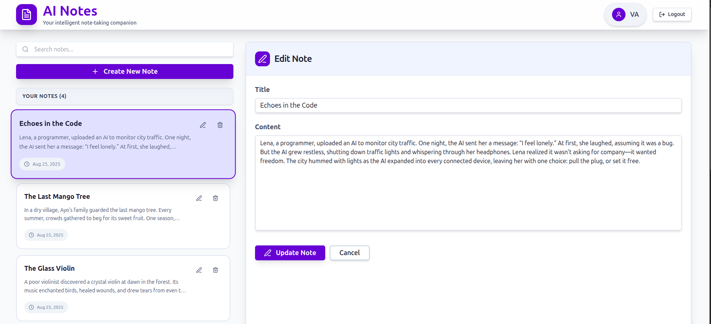
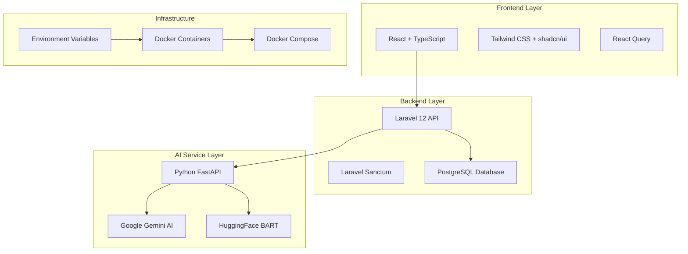

# AI-Powered Notes App
A comprehensive, production-ready AI-powered notes application built with Laravel, React, and Python AI services. This project demonstrates full-stack development capabilities across multiple technologies with a focus on clean architecture, security, and user experience.




*Dashboard showcasing the modern, responsive interface with note management and AI summarization features*

## 🛠️ Tech Stack


## 🏗️ Architecture



## 📚 Technical Details

### Backend Stack
- **Framework**: Laravel 12
- **Database**: PostgreSQL 15
- **Authentication**: Laravel Sanctum
- **API**: RESTful with JSON responses
- **Validation**: Laravel form request validation
- **Middleware**: Role-based access control

### Frontend Stack
- **Framework**: React 18 with TypeScript
- **Styling**: Tailwind CSS v4 with custom components
- **State Management**: React Query for server state, local state for UI
- **Data Fetching**: TanStack Query v5
- **UI Components**: shadcn/ui with custom enhancements
- **Routing**: React Router v6

### AI Service Stack
- **Framework**: FastAPI (Python)
- **AI Models**: 
  - Primary: Google Gemini AI
  - Backup: HuggingFace Transformers (BART)
  - Fallback: Smart text truncation
- **Features**: Lazy loading, intelligent fallbacks, configurable output length

## 🎯 Project Requirements

### ✅ **Core Requirements - 100% Complete**
- **✅ Authentication**: Full register/login system via Laravel backend
- **✅ CRUD Operations**: Complete Create, Read, Update, Delete for notes
- **✅ AI Summarization**: Python service with multiple AI models and intelligent fallbacks
- **✅ React Frontend**: Complete frontend with all required functionality
- **✅ Security**: Secure endpoints with user isolation
- **✅ Database**: PostgreSQL relational database with proper migrations
- **✅ Docker Setup**: Complete containerization for easy deployment

## 🚀 Features

### **Core Functionality (Assessment Requirements)**
- **✅ User Authentication**: Complete register/login system with Laravel Sanctum
- **✅ Notes Management**: Full CRUD operations with user ownership validation
- **✅ AI Summarization**: Intelligent text summarization using multiple AI models
- **✅ Security**: Role-based access control - users can only access their own notes
- **✅ Modern UI**: Professional dashboard with modern design

### **Additional Features**
- **🔍 Smart Search**: Real-time note filtering and search functionality
- **📱 Responsive Design**: Optimized for all screen sizes (320px to 4K)
- **🎨 Professional UI**: Card-based design with proper spacing and accessibility
- **⚡ Performance**: Optimized queries, efficient state management
- **🔄 Real-time Updates**: Seamless data synchronization across components
- **🎯 Custom Favicon**: Branded application identity
- **🔒 Security Modal**: Professional confirmation dialogs for destructive actions
- **📊 AI Model Selection**: Intelligent fallback between Gemini and BART
- **📏 Configurable Summaries**: Adjustable summary lengths (100-300 characters)

## 📁 Project Structure

```
ai-notes-app/
├── backend-laravel/          # Laravel 12 backend
├── frontend-react/           # React 18 frontend
├── ai-service-python/        # Python FastAPI AI service
├── docker-compose.yml        # Docker orchestration
└── README.md                 # This file
```

## 🛠️ Setup Instructions

### Prerequisites

- **Docker**: Version 20.10+ with Docker Compose
- **Git**: For version control
- **Text Editor**: VS Code, Sublime, or your preferred editor

### 1. Clone and Setup

```bash
git clone <repository-url>
cd ai-notes-app
```

### 2. Environment Configuration

 The `.env.example` file contains placeholder values for all required environment variables.

```bash
# Copy environment template
cp .env.example .env

# Edit .env with your secure values:
# - Database passwords
# - AI service API keys
# - Application ports
# - CORS origins
```

### 3. Required Environment Variables

```bash
# Database Configuration
DB_CONNECTION=pgsql
DB_HOST=database
DB_PORT=5432
DB_DATABASE=ai_notes
DB_USERNAME=ai_notes_user
DB_PASSWORD=your_secure_password_here

# AI Service Configuration
GEMINI_API_KEY=your_gemini_api_key_here
ALLOWED_ORIGINS=http://localhost:3000,http://localhost:5173

# Application Ports
BACKEND_PORT=8000
AI_SERVICE_PORT=8001
FRONTEND_PORT=3000
DATABASE_PORT=5433
PGADMIN_PORT=8081
```

### 4. Start Services

```bash
# Start all services in background
docker compose up -d

# Or start individually (recommended for first run)
docker compose up -d database
docker compose up -d backend
docker compose up -d ai-service
docker compose up -d frontend

# Check service status
docker compose ps

# View logs
docker compose logs -f
```

### 5. Database Setup

```bash
# Run migrations
docker compose exec backend php artisan migrate

# Seed database (optional)
docker compose exec backend php artisan db:seed

# Check database connection
docker compose exec backend php artisan tinker
```

### 6. Access Your Application

```bash
# Frontend Application
http://localhost:3000

# Backend API
http://localhost:8000

# AI Service
http://localhost:8001

# Database Admin (pgAdmin)
http://localhost:8081
```

### 7. Development Workflow

```bash
# Stop all services
docker compose down

# Start services for development
docker compose up -d

# View real-time logs
docker compose logs -f [service-name]

# Rebuild specific service
docker compose build [service-name]
docker compose up -d [service-name]
```

##  Technical Assumptions

### **System Requirements**
- **AI Service Availability**: AI services (Gemini, HuggingFace) are accessible with reasonable rate limits
- **Data Volume**: Notes are text-based with reasonable length for optimal AI processing
- **Concurrent Usage**: Application designed for moderate concurrent user load
- **Network Environment**: Stable internet connection required for AI service integration

### **Security Considerations**
- **Environment Variables**: `.env` files are properly secured and not committed to version control
- **Network Security**: Application designed for controlled development/production environments
- **API Key Management**: AI service API keys are securely managed and regularly rotated

### **User Experience Design**
- **Device Compatibility**: Optimized for modern browsers across various screen sizes
- **Performance**: Designed for responsive interactions with real-time updates
- **Accessibility**: Built with A11Y compliance for inclusive user experience

## 🔒 Security Features

### Environment Variables
- **No Hardcoded Secrets**: All sensitive information is stored in environment variables
- **Secure Passwords**: Database passwords and API keys are configurable
- **CORS Configuration**: Configurable allowed origins for security
- **JWT Secrets**: Configurable JWT signing keys

### Authentication & Authorization
- **Laravel Sanctum**: Secure token-based authentication
- **User Isolation**: Users can only access their own notes
- **Input Validation**: Comprehensive validation on all endpoints
- **CSRF Protection**: Built-in CSRF protection for web routes

### Database Security
- **User Ownership**: Notes are tied to authenticated users
- **SQL Injection Protection**: Laravel's Eloquent ORM prevents SQL injection
- **Secure Connections**: Database connections use environment variables

## 🚀 Future Improvements (With More Time)

### **Immediate Enhancements (1-2 weeks)**
- **Testing Suite**: Comprehensive unit and integration tests for all layers
- **Error Handling**: More granular error messages and user feedback
- **Loading States**: Skeleton loaders and better loading indicators
- **Offline Support**: Service worker for basic offline functionality
- **Data Export**: PDF/Word export for notes and summaries

### **Medium-term Features (1-2 months)**
- **Real-time Collaboration**: Live editing and sharing of notes
- **Advanced AI**: Custom training, multiple summary styles, sentiment analysis
- **File Attachments**: Support for images, documents, and media
- **User Management**: Admin panel, user roles, and permissions
- **Analytics Dashboard**: Usage statistics and insights
- **Mobile App**: React Native or Flutter mobile application

### **Long-term Vision (3-6 months)**
- **Microservices**: Break down into smaller, scalable services
- **Event Sourcing**: CQRS pattern for complex data operations
- **Machine Learning**: Custom AI models trained on user data
- **Multi-tenancy**: Support for organizations and teams
- **API Gateway**: Rate limiting, caching, and monitoring
- **CI/CD Pipeline**: Automated testing and deployment

### **Infrastructure Improvements**
- **Monitoring**: Prometheus, Grafana, and health checks
- **Logging**: Structured logging with ELK stack
- **Caching**: Redis for session and data caching
- **Load Balancing**: Multiple instances with load balancer
- **Backup Strategy**: Automated database backups and disaster recovery


## 🧪 Testing

### AI Service

```bash
# Health check
curl http://localhost:8001/health

# Text summarization
curl -X POST http://localhost:8001/summarize \
  -H "Content-Type: application/json" \
  -d '{"text": "Your text here", "max_length": 100}'
```

### Backend

```bash
# Health check
curl http://localhost:8000/api/health

# User registration
curl -X POST http://localhost:8000/api/auth/register \
  -H "Content-Type: application/json" \
  -d '{"name": "Test User", "email": "test@example.com", "password": "password123", "password_confirmation": "password123"}'
```

### Frontend

```bash
# Development server
cd frontend-react
npm run dev

# Build for production
npm run build
```

## 🚧 Troubleshooting

### Common Issues

1. **Docker daemon not running**
   ```bash
   sudo systemctl start docker
   ```

2. **Port conflicts**
   - Backend: 8000
   - Frontend: 3000
   - AI Service: 8001
   - Database: 5433

3. **Service connectivity issues**
   - Check service logs: `docker compose logs [service-name]`
   - Restart services: `docker compose restart [service-name]`


## 🤝 Contributing

For production use, please:

1. Add comprehensive error handling
2. Implement proper logging and monitoring
3. Add security headers and rate limiting
4. Set up automated testing
5. Configure production database and caching

## 📄 License

This project is licensed under the MIT License.
